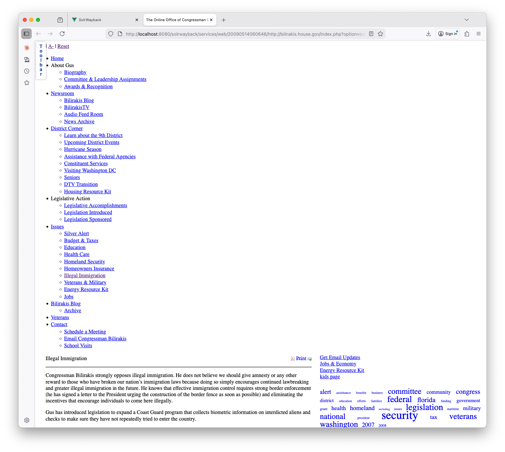

# Programming Historian English Language Lesson Template

This file can be used as a template for writing your lesson. It includes information and guidelines on formatting which supplement but do not replace the author's guidelines (/en/author-guidelines)

## Some Important Reminders:

*	Tutorials should not exceed 8,000 words (including code).
*	Keep your tone formal but accessible.
*	Talk to your reader in the second person (you).
*	Adopt a widely-used version of English (British, Canadian, Indian, South African etc).
*	The piece of writing is a "tutorial" or a "lesson" and not an "article".
*  Adopt open source principles
*  Write for a global audience
*  Write sustainably

# Lesson Metadata

**Delete everything above this line when ready to submit your lesson**.

---
title: Exploring the Archived Web with SolrWayback  
collection: lessons  
layout: lesson  
authors:
- Victor Harbo Johnston 
---

# Table of Contents



--
# Lesson Aims
When readers have finished this lesson, they will be able to:
* Set up SolrWayback on their local computer
* Load sources from the archived web into their SolrWayback instance
* Investigate and explore the archived web through SolrWayback 

# Lesson Structure

The lesson is divided into five distinct sections: 
1. Introduction
2. Download 
3. Start up
4. Indexing
5. Querying and Visualising

The introduction present some of the existing challenges of working with the archived web and how a tool as SolrWayback can help historians and other scholars from the humanities to work with the archived web as part of their source material. The next three sections revolves around installing, starting and getting data loaded into the software. Finally the lesson explores how the archived web can be investigated through SolrWayback. Furthermore this section provides insights into some of the build-in visualisation tools of the software. The lesson makes use of archived websites from the End of Term Web Archive. The lesson only uses a subset of the full collection as the collection from the 2008 collection is more than 15TB of data in total.

# Exploring the Archived Web with SolrWayback  

## Introduction

TODO: Write a broader introduction to archived web as a source.

When institutions such as the Internet Archive (IA), the Royal Danish Library (RDL) or the Bibliothèque nationale de France (BnF) archives the internet, they store the data in [WARC-files](https://en.wikipedia.org/wiki/WARC_(file_format)). WARC files can be daunting to work with if you have not seen them before as they are archival and technical by nature.[^1] Furthermore their primary objective is to secure that the archived web can be saved for posterity therefore they prioritize effective long time preservation above usability. This lesson teaches a method, which can be used to unlock the potential of WARC files as a resource for research. To do this the lesson introduces the Open Source software SolrWayback.

SolrWayback is a search and discovery tool, created to make the archived web search- and viewable in one solution. Other tools for playback do exist, eg. [pywb](https://github.com/webrecorder/pywb). However, no other tool currently provides the search and discovery possibilities that SolrWayback does. Through this software it is possible to search for individual words and phrases throughout your collection. It can also be used as a tool to narrow which parts of a collection you are interested in as part of your research. The software provides multiple ways of exporting subsets of the data for further analysis.[^2]

## Aquire WARC files
During this lesson you will work with WARC files from the End of Term Web Archive (EOTWA). This web archive preserves U.S. Government websites when a presidential administration comes to an end. the EOTWA has done this systematically since 2008. The collections in their archive have grown exponentially between elections.

| Dataset                | Compressed Size of all WARCs |
| ---------------------- | ---------------------------- |
| EOT-2008               | 15.32 TB                     |
| EOT-2012               | 41.42 TB                     |
| EOT-2016               | 139.3 TB                     |
| EOT-2020               | 266.04 TB                    |
| EOT-2024 (In progress) | 1492.8 TB                    |

Figuring out how to extract WARC files from this archive can be tricky as their documentation is technical by nature. In this lesson you will download six WARC files from the EOT-2008 collection and these files will act as your corpus. Bear in mind that these six WARC files are less than 1 GB in size. This means that the corpus you are working on during this lesson only is a fraction of the total 2008 collection. The WARC files which you should download are available at the following links and are randomly chosen from the EOT-2008 collection:

- https://eotarchive.s3.amazonaws.com/crawl-data/EOT-2008/segments/CDL-004/warc/CDL-20090514060129-00186-dp01.cdlib.org.warc.gz
- https://eotarchive.s3.amazonaws.com/crawl-data/EOT-2008/segments/CDL-004/warc/CDL-20090514060157-00299-dp01.cdlib.org.warc.gz
- https://eotarchive.s3.amazonaws.com/crawl-data/EOT-2008/segments/CDL-004/warc/CDL-20090514060327-01089-dp01.cdlib.org.warc.gz
- https://eotarchive.s3.amazonaws.com/crawl-data/EOT-2008/segments/CDL-004/warc/CDL-20090514060354-00090-dp01.cdlib.org.warc.gz
- https://eotarchive.s3.amazonaws.com/crawl-data/EOT-2008/segments/CDL-004/warc/CDL-20090514060400-01090-dp01.cdlib.org.warc.gz
- https://eotarchive.s3.amazonaws.com/crawl-data/EOT-2008/segments/CDL-004/warc/CDL-20090514060442-00040-dp01.cdlib.org.warc.gz

For now either save these files in their own directory or let them stay in your downloads folder. You need to be able to find them again, when you get to the section of the lesson that handles indexing.

## Download
To get started with SolrWayback, the first thing you need to do is to download the software from the SolrWayback Github page. The software can be installed in multiple ways, however in this lesson you will install it through the bundle release version, which is the most common way. To get started navigate to the [release page](https://github.com/netarchivesuite/solrwayback/releases) of SolrWayback and download version 5.4.2 (This was the newest version when this lesson was written. This lesson will work for newer versions as well).

When you've downloaded the correct version please unzip the file, where you want it on your computer. The unzipped directory will have the name: `solrwayback_package_5.4.2`. Inside the directory a folder named properties exists. Please copy the two files from inside this folder to your home directory. On a Linux/Mac this directory is called `/Users/yourUsername` and on windows it is located at `C:\Users\yourUsername\`. You are now ready to start SolrWayback and index your first WARC files. The next sections of this lesson are operation system dependent, so they will contain separate sections for Linux/Mac and Windows respectively.

## Start up
With the SolrWayback bundle downloaded and having moved your properties to your home directory you are ready to start the software. This is done through a terminal by issuing two commands. Please follow the section below according to your OS. The two commands that you need to do starts the two parts of the application. The first command starts the webserver that is included in the application and the second command starts the search engine in the application.

  

    <h3>Linux/Mac</h3>
    
This is some text in the first column.

  

  

    <h3>Windows</h3>
    
This is some text in the second column.

    <ul>
      <li>Item C</li>
      <li>Item D</li>
    </ul>
  

Now you have SolrWayback running. To verify that it runs you can access the program in your webbrowser by entering the URL: http://localhost:8080/solrwayback/. Here you should see the frontpage of the apllication which looks like this: 

<!--  -->

You have now started the application successfully and are ready to make the WARC files from the EOTWA searchable in the system.

## Indexing
SolrWayback is build with a search engine named Solr. To make your WARC files available for querying in SolrWayback you need to index the files. This process is OS dependent just as the start up above was. The first thing you need to do is to move the WARC files, which you downloaded earlier into their permanent place. For this lesson please move them into the directory `indexing/warcs1` inside the `solrwayback_package_5.4.2`. It is important to know that when you have indexed the WARC files, they cannot be moved from their current location as moving them afterwards will destroy the playback of the files until a new index has been built. The following is to be done in your Command Line Interface (e.g. Terminal or Powershell).

  

    <h3>Linux/Mac</h3>
    
To index your WARC files from the directory <code>solrwayback_package_5.4.2/indexing/warcs1</code> please move into the directory <code>indexing</code> and run the following command in your terminal: <code>THREADS=2 ./warc-indexer.sh warcs1/*</code>.
 
  

  

    <h3>Windows</h3>
    
To index your WARC files from the directory <code>solrwayback_package_5.4.2/indexing/warcs1</code> please move into the directory <code>indexing</code> and run the following bat-file in your terminal: <code>batch_warcs1_folder.bat</code>

    
NOTE: On Windows it is very important that you follow the directions above explicitly and moves into the directory before you run the <code>.bat</code>-file.

  

<!--  -->

This will start indexing of all documents in the warcs1 folder. You should see some output in your terminal. This is information on how the indexing is processing and are expected. When the indexing has finished your terminal will return to an interactive state, represented by a `$` and now you should be able to see the indexed documents in the SolrWayback web interface. To validate that the documents have been indexed, you can go to the application at the URL: http://localhost:8080/solrwayback/ and type `*:*` in the search box. This is a wildcard query that fetches all documents available in the application. This should return 6.031 results.

You have now successfully indexed your WARC files into SolrWayback and can begin exploring their contents through the software. If you want to add other WARC files to SolrWayback after you have finished this lesson, you can place them in either of the included `warcs1` or `warcs2` folders and then run the indexing command again.

## Querying and Visualising
You are now ready to start exploring your collection and discover interesting sources related to the End of Term collection from 2008. Many questions can be answered with sources from this collection. Throughout the next session some examples will be introduced. These examples have been chosen as the subset of the collection you are exploring in this lesson contain relevant documents.

If for instance you are interested in analysing politicians views on immigration a starting point could be a query for the word `immigration`. In your small subset of the overall corpus, this query provides you with 80 results. If you press the top result, comming from the URL [http://bilirakis.house.gov...](http://localhost:8080/solrwayback/services/web/20090514060646/http://bilirakis.house.gov/index.php?option=com_content&task=view&id=193&Itemid=132) you are presented with a replayed version of the archived webpage.

This webpage was harvested at the 14th of May 2009. When examining the Bilirakis website from 2009. The first thing that comes to mind is that the site is not very good looking. To understand why the page is presented like this we need to think of how the web and therefore also the archived web is constructed in the first place. The web is born fragmented and when a website is shown to you as a user, you could in theory be looking at a website where the text is located at one server and an image is located somewhere completely different. (TODO: reference to Brügger 2018, chapter 2) This fragmentation of source material also means that you cannot expect sources to shown in a complete state in the test corpus that you are working with here, as parts of the resources that are used to construct the webpage simply aren't available in the few archival sources that you have in hand through this lesson. In other words, the replay of the Bilirakis webpage might almost certainly be better if you had all or more material downloaded from the EOTWA.  

<!--  -->

To get an overview of how an individual site has been archived, SolrWayback provides a small but useful toolbar, when an archived site is shown. By pressing the toolbar in the top left corner and then pressing the button `View page resources`, you can get information on how the individual resources from the currently shown page have been archived. This also gives us the answer to why the shown version of the site above is mostly links and text. The resource overview below clearly shows that sixteen different resources that were part of the webpage when it was live is not included in your archived version. If you had been working with the complete version of the EOTWA collection the replay would be better as the missing resources are most likely located in some of the many other WARC files available at the End of Term Web Archive.

<!--  -->

The search field in SolrWayback supports a multitude of complex search functionalities. They can however be hard to navigate when using the software for the first time. In general the search box supports all types of search that you would expect in an information retrieval system or a library database. This includes traditional use of boolean operators such as AND, OR and NOT. They must be entered in uppercase or else the search technology understands them as search terms instead of boolean operators. To continue on our example from above you might be interested in searching for the terms `immigration OR immigrant` to broaden the results from before. This provides you with 180 results compared to the `immigration`-query, which only provided 80 results in our subset of the archive. If on the other hand you needed to narrow the results from the query this can be achieved by using the boolean operator AND. An example of such a query could be `immigration AND mexican`, which only returns one result in our very limited corpus. These operators can also be used in combination, but then you would need to use parenthesis to group search terms that are related to the individual boolean operators. Staying with the example of immigration a combined query could look like this: `immigration OR (mexican AND immigrant)`.

Another standard searching functionality is wildcard searches. SolrWayback supports the following as a search term: `immigra*`. This returns all 192 results that contain any words starting with immigra- such as immigrant, immigration and such. Another wildcard character is `?`. The question mark replaces a single character in a search term. This can be useful in different contexts but especially when investigating sources that can be written in american or british english. For instance a query for `Analy?e ` captures results from analyse and analyze. In our example this specific query returns 34 results that are all of the american variation as we are working with a very little subset of a vast US centred archive. A third way of specifying queries in the search field is with the use of quotation marks. These can be used to search for specific sentences. A search for `"mexican immigrant"` return results where the words occur directly after each other, where as the earlier query of `mexican AND immigrant` returned results where the words where present in the same document, but not necessarily in the same sentence.

The searching strategies above are often available in all sorts of information retrieval systems and they provide a basis for constructing complex queries. SolrWayback also provide searching capabilities that are tailored towards the specific content from archived web material. Content and metadata for each document in your archive have been parsed and analysed during the indexing section above. In practise this means, that a lot of the metadata is searchable in specific metadata *fields*. A specific field can contain one type of content and only that type. For instance, all documents have the field `content_length` which contains a number representing how much content is available in the given document. A long text document would have a high number in this field, where as a short status update or an almost empty website would have a much lower number in this field. Searchable fields can be inputted as a query following the syntax: `fieldname:value in field`. To search for a specific value in the content length field you would do the following query to search for documents with a content length of exactly 500: `content_length:500`. In your corpus this returns zero results. This is due to the fact that content lengths are often hard to specify directly. Luckily SolrWayback supports *range queries*. This is a type of query that can be used to specify an interval or limit on the number in a field. A range query follows the syntax `fieldname:[value TO value]`. So if you want to search for web pages that have a content length between 1000 and 5000, this would be achievable by: `content_length:[1000 TO 5000]` which returns 620 results. The range query syntax can also be used to define either a upper or lower limit. To do so an asterisk takes the place of the open end of the range query. To query for documents that have a content length of less than 1000 you can query with `content_length:[* TO 1000]` and a search for documents with a content length above 5000 can be achieved with `content_length:[5000 TO *]`.

The section above uses the field `content_length` as the primary example of how to query with a field. SolrWayback contain multiple of these fields. The easiest way to get an overview of these is to do a query for anything, it could be `*:*` and then press the `View data fields`-button circled in the image below:

<!--  -->

When you press this button a list of available fields will be presented. Here you see fields such as `content`, `content_type`, `crawl_date`, `elements_used`, `links` and many more. Most of these fields can be used in queries just as the `content_length` above. These fields can be used in multiple ways to construct very niche searches. For now it is enough to know where to find them for future reference.

### Buttons below the search bar
You have now learned the basics of how the search field functions. As you will see throughout the rest of this lesson, SolrWayback contains many ways to navigate the archived web as a source. Right below the search bar two important toggle buttons are available. The two toggles presented here are `Grouped search` and `URL search`. 

Throughout this lesson you are working with a small subset of a bigger collection. Often, when working with the archived web you will be sifting through not only millions of documents, but also multiple copies of identical documents as archiving technologies archive all URLs even though an identical copy of the source already exist in the collection. [TODO: Reference Gomes et al.] The grouped search functionality in SolrWayback collapses results by URL into one when ticked. This can be very useful when exploring collections of more sources. 

The `ULR Search`-button contains another functionality which is important for you to know about as part of having search introduced in this program. The use case for this button is the following, very common, situation. You have a collection of material and are interested in finding one special web page located at a specific URL. A case for this kind of use in your small collection could be to find the webpage of congress woman Virginia Foxx and you know that her web page have been archived from the specific URL: http://foxx.house.gov/index.cfm?sectionid=102&sectiontree=&pageNum=51. If you copy this URL directly into the search field and try to search for it, no results will be available. If however you tick the `URL Search`-button and redo your search, a result will be found. Why is this so you may ask? URLs often contain special characters as '&' and '#'. When you ticked the `URL Search`-box, you instructed the software to handle these characters directly as part of the URL and therefore you get a valid result in this case.  

TODO: write sum-up of this section

### Relationship between search and facets

Until now, the lesson has been focused on how to search through the search bar. Another step in the search process is to apply facets to filter unwanted material away.

If you do a new `*:*`-query and then have a look at the resulting page. Here you get some useful information on the left of the screen. These are facets that give you an overview of content in your collection and they can be used to tailor your search. When a facet is clicked, it will be applied to your query and only documents with that value in the faceted field will be included in the result. 

 TODO: Give this the right caption and file name
<!--  TODO: Give this the right caption and file name -->

Facets can also be used to give an immediate overview of how the material in the collection is scattered on different domains, content types or crawl years etc. One important thing to mention in relation to facets is the relationship between entries in the search bar and the application of facets. Facets need to be applied last as a change to the input in the search box resets the query and removes any applied facets.

TODO: Short introduction to the navigation history feature

TODO: Toolbox introduction
TODO: Visualisation tools 

## Conclusion

## Literature
Kurzmeier, Michael. “Contextualizing and Unlocking Political Web Defacements for Research.” _Journal of Digital History_, no. preprint (2025).

Maemura, Emily. “All WARC and No Playback: The Materialities of Data-Centered Web Archives Research.” _Big Data & Society_ 10, no. 1 (2023): 20539517231163172. [https://doi.org/10.1177/20539517231163172](https://doi.org/10.1177/20539517231163172).

Ruest, Nick, Samantha Fritz, and Ian Milligan. “Creating Order from the Mess: Web Archive Derivative Datasets and Notebooks.” _Archives and Records_ 43, no. 3 (2022): 316–31. [https://doi.org/10.1080/23257962.2022.2100336](https://doi.org/10.1080/23257962.2022.2100336).

### Inserting Images:

Copy this short-code to insert an image. Replace words in all caps with your image information (eg, Figure1.jpg). Captions should include sequential image numbering (eg "Figure 1: ..."). 



##### Endnotes
[^1]: Maemura, Emily. “All WARC and No Playback: The Materialities of Data-Centered Web Archives Research.” _Big Data & Society_ 10, no. 1 (2023): 20539517231163172. [https://doi.org/10.1177/20539517231163172](https://doi.org/10.1177/20539517231163172). Ruest, Nick, Samantha Fritz, and Ian Milligan. “Creating Order from the Mess: Web Archive Derivative Datasets and Notebooks.” _Archives and Records_ 43, no. 3 (2022): 316–31. [https://doi.org/10.1080/23257962.2022.2100336](https://doi.org/10.1080/23257962.2022.2100336).

[^2]: Kurzmeier, Michael. “Contextualizing and Unlocking Political Web Defacements for Research.” _Journal of Digital History_, no. preprint (2025).

