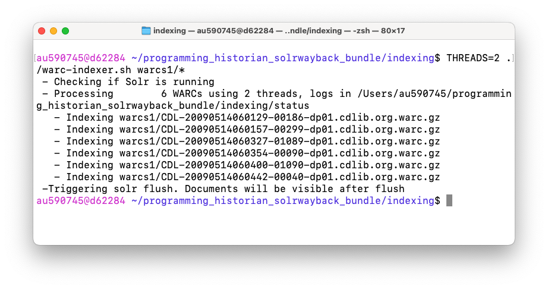
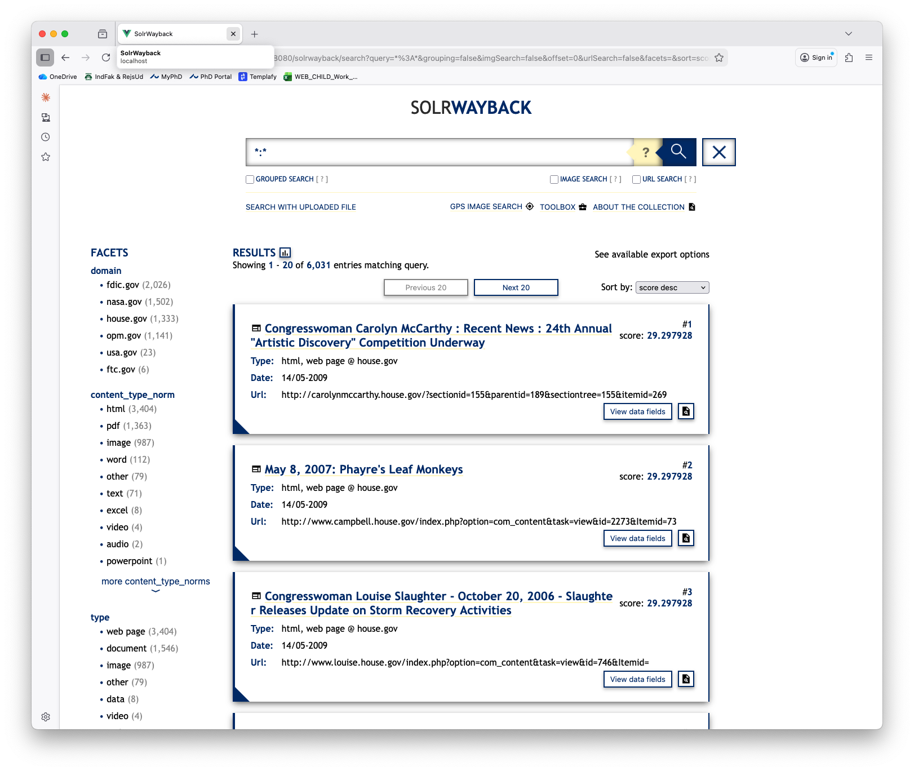

# Programming Historian English Language Lesson Template

This file can be used as a template for writing your lesson. It includes information and guidelines on formatting which supplement but do not replace the author's guidelines (/en/author-guidelines)

## Some Important Reminders:

*	Tutorials should not exceed 8,000 words (including code).
*	Keep your tone formal but accessible.
*	Talk to your reader in the second person (you).
*	Adopt a widely-used version of English (British, Canadian, Indian, South African etc).
*	The piece of writing is a "tutorial" or a "lesson" and not an "article".
*  Adopt open source principles
*  Write for a global audience
*  Write sustainably

# Lesson Metadata

**Delete everything above this line when ready to submit your lesson**.

---
title: Exploring the Archived Web with SolrWayback  
collection: lessons  
layout: lesson  
authors:
- Victor Harbo Johnston 
---

# Table of Contents



--
# Lesson Aims
When readers have finished this lesson, they will be able to:
* Set up SolrWayback on their local computer
* Load sources from the archived web into their SolrWayback instance
* Investigate and explore the archived web through SolrWayback 

# Lesson Structure

The lesson is divided into five distinct sections: 
1. Introduction
2. Download 
3. Start up
4. Indexing
5. Querying and Visualising

The introduction present some of the existing challenges of working with the archived web and how a tool as SolrWayback can help historians and other scholars from the humanities to work with the archived web as part of their sourcematerial. The next three sections revolves around installing, starting and getting data loaded into the software. Finally the lesson explores how the archived web can be investigated through SolrWayback. Furthermore this section provides insights into some of the build-in visualisation tools of the software. The lesson makes use of archived websites from the End of Term Webarchive. The lesson only uses a subset of the full collection as the collection from the 2008 collection is more than 15TB of data in total.

# Exploring the Archived Web with SolrWayback  

## Introduction

When institutions such as the Internet Archive (IA), the Royal Danish Library (RDL) or the Bibliothèque nationale de France (BnF) archives the internet, they store the data in [WARC-files](https://en.wikipedia.org/wiki/WARC_(file_format)). WARC files can be daunting to work with if you have not seen them before as they are archival and technical by nature.[^1] Furthermore their primary objective is to secure that the archived web can be saved for posterity therefore they prioritize effective long time preservation above usability. This lesson teaches a method, which can be used to unlock the potential of WARC files as a resource for research. To do this the lesson introduces the Open Source software SolrWayback.

SolrWayback is a search and discovery tool, created to make the archived web search- and viewable in one solution. Other tools for playback do exist, eg. [pywb](https://github.com/webrecorder/pywb). However, no other tool currently provides the search and discovery possibilities that SolrWayback does. Through this software it is possible to search for individual words and phrases throughout your collection. It can also be used as a tool to narrow which parts of a collection you are interested in as part of your research. The software provides multiple ways of exporting subsets of the data for further analysis.[^2]

## Aquire WARC files
During this lesson you will work with WARC files from the End of Term Web Archive (EOTWA). This webarchive preserves U.S. Government websites when a presidential administration comes to an end. the EOTWA has done this systematically since 2008. The collections in their archive have grown exponentially between elections.

| Dataset                | Compressed Size of all WARCs |
| ---------------------- | ---------------------------- |
| EOT-2008               | 15.32 TB                     |
| EOT-2012               | 41.42 TB                     |
| EOT-2016               | 139.3 TB                     |
| EOT-2020               | 266.04 TB                    |
| EOT-2024 (In progress) | 1492.8 TB                    |

Figuring out how to extract WARC files from this archive can be tricky as their documentation is technical. In this lesson you will download six WARC files from the EOT-2008 collection and these files will act as your corpus. Bear in mind that these six WARC files are less than 1 GB in size. This means that the corpus you are working on here is only a fraction of the total 2008 collection. The WARC files which you should download are available at the following links and are randomly chosen from the EOT-2008 collection:
- https://eotarchive.s3.amazonaws.com/crawl-data/EOT-2008/segments/CDL-004/warc/CDL-20090514060129-00186-dp01.cdlib.org.warc.gz
- https://eotarchive.s3.amazonaws.com/crawl-data/EOT-2008/segments/CDL-004/warc/CDL-20090514060157-00299-dp01.cdlib.org.warc.gz
- https://eotarchive.s3.amazonaws.com/crawl-data/EOT-2008/segments/CDL-004/warc/CDL-20090514060327-01089-dp01.cdlib.org.warc.gz
- https://eotarchive.s3.amazonaws.com/crawl-data/EOT-2008/segments/CDL-004/warc/CDL-20090514060354-00090-dp01.cdlib.org.warc.gz
- https://eotarchive.s3.amazonaws.com/crawl-data/EOT-2008/segments/CDL-004/warc/CDL-20090514060400-01090-dp01.cdlib.org.warc.gz
- https://eotarchive.s3.amazonaws.com/crawl-data/EOT-2008/segments/CDL-004/warc/CDL-20090514060442-00040-dp01.cdlib.org.warc.gz

For now either save these files in their own directory or let them stay in your downloads folder. You need to be able to find them again, when you get to the section of the lesson that handles indexing.

## Download
To get started with SolrWayback, the first thing you need to do is to download the software from the SolrWayback Github page. The software can be installed in multiple ways, however in this lesson you will install it through the bundle release version, which is the most common way. To get started navigate to the [release page](https://github.com/netarchivesuite/solrwayback/releases) of SolrWayback and download version 5.2.1 (This was the newest version when this lesson was written. This guide will most likely work for newer versions as well).

When you've downloaded the correct version please unzip the file, where you want it on your computer. The unzipped directory will have the name: `solrwayback_package_5.2.1`. Inside the directory a folder named properties exists. Please copy the two files from inside this folder to your home directory. On a Linux/Mac this directory is called `/Users/yourUsername` and on windows it is located at `C:\Users\yourUsername\`. You are now ready to start SolrWayback and index your first WARC files. The next sections of this lesson are operation system dependent, so they will contain separate sections for Linux/Mac and Windows respectively.

## Start up
With the SolrWayback bundle downloaded and having moved your properties to your home directory you are ready to start the software. This is done through a terminal by issuing two commands. Please follow the section below according to your OS. The two commands that you need to do starts the two parts of the application. The first command starts the webserver that is included in the application and the second command starts the search engine in the application.

  

    <h3>Linux/Mac</h3>
    
This is some text in the first column.

  

  

    <h3>Windows</h3>
    
This is some text in the second column.

    <ul>
      <li>Item C</li>
      <li>Item D</li>
    </ul>
  

Now you have SolrWayback running. To verify that it runs you can access the program in your webbrowser by entering the URL: http://localhost:8080/solrwayback/. Here you should see the frontpage of the apllication which looks like this: 

<!--  -->

You have now started the application succesfully and are ready to make the WARC files from the EOTWA searchable in the system.

## Indexing
SolrWayback is build with a search engine named Solr. To make your WARC files available for querying in SolrWayback you need to index the files. This process is OS dependent just as the start up above was. The first thing you need to do is to move the WARC files, which you downloaded earlier into their permanent place. For this lesson please move them into the directory `indexing/warcs1` inside the `solrwayback_package_5.2.1`. It is important to know that when you have indexed the WARC files, they cannot be moved from their current location as moving them afterwards will destroy the playback of the files until a new index has been built. The following is to be done in your Command Line Interface (e.g. Terminal or Powershell).

  

    <h3>Linux/Mac</h3>
    
To index your WARC files from the directory <code>solrwayback_package_5.2.1/indexing/warcs1</code> please move into the directory <code>indexing</code> and run the following command in your terminal: <code>THREADS=2 ./warc-indexer.sh warcs1/*</code>.
 
  

  

    <h3>Windows</h3>
    
To index your WARC files from the directory <code>solrwayback_package_5.2.1/indexing/warcs1</code> please move into the directory <code>indexing</code> and run the following bat-file in your terminal: <code>batch_warcs1_folder.bat</code>

    
NOTE: On Windows it is very important that you follow the directions above explicitly and moves into the directory before you run the <code>.bat</code>-file.

  

<!--  -->

This will start indexing all documents in the warcs1 folder. You shoud see some output in your terminal. This is information on how the indexing is processing and are expected. When the indexing has finished your terminal will return to an interactive state, repesented by a `$` and now you should be able to see the indexed documents in the SolrWayback web interface. To validate that the documents have been indexed, you can go to the application at the URL: http://localhost:8080/solrwayback/ and type `*:*` in the search box. This is a wildcard query that fetches all sources in the application. This should return 6.031 results.

You have now successfully indexed your WARC files into SolrWayback and can now begin exploring their contents through the software. If you want to add other WARC files to SolrWayback after you have finished this lesson, you can either place them in the included `warcs1` or `warcs2` folders and then run the related indexing command again.

## Querying and Visualising
You are now ready to start exploring your collection and discover interesting sources related to the US Election 2008. When examining your `*:*`-query from above you get some information to the left of the screen. These are facets that give you an overview of content in your collection and they can be used to tailor your search. When a facet os clicked, it will be applied to your query.

<!--  -->

If for instance you are interested in analysing politicians views on immigration a starting point could be a query for the word `immigration`. In your small subset of the corpus, this query provides you with 80 results. If you press the top result, comming from the URL [http://bilirakis.house.gov...](http://localhost:8080/solrwayback/services/web/20090514060646/http://bilirakis.house.gov/index.php?option=com_content&task=view&id=193&Itemid=132) you are presented with the archived webpage. This webpage was harvested at the 14th of May 2009. When examining the Bilirakis website from 2009. The first thing that comes to mind is that the site is not that pretty. To understand why the page is presented like this we need to think of how the web and therefore also the archived web is constructed in the first place. The web is born fragmented and when a website is shown to you as a user, you could in theory be looking at a website where the text is located at one server and an image is located somewhere completely different. (TODO: reference to Brügger 2018, chapter 2) This fragmentation of source material also means that you cannot expect sources to shown in a complete state in the test corpus that you are working with here, as parts of the ressources that are used to construct the webpage simply aren't available in the few archival sources that you have in hand here. With this said, the replay of the Bilirakis webpage might be better if you had all or more material downloaded from EOTWA.  

<!--  -->

## Conclusion

## Literature
Kurzmeier, Michael. “Contextualizing and Unlocking Political Web Defacements for Research.” _Journal of Digital History_, no. preprint (2025).

Maemura, Emily. “All WARC and No Playback: The Materialities of Data-Centered Web Archives Research.” _Big Data & Society_ 10, no. 1 (2023): 20539517231163172. [https://doi.org/10.1177/20539517231163172](https://doi.org/10.1177/20539517231163172).

Ruest, Nick, Samantha Fritz, and Ian Milligan. “Creating Order from the Mess: Web Archive Derivative Datasets and Notebooks.” _Archives and Records_ 43, no. 3 (2022): 316–31. [https://doi.org/10.1080/23257962.2022.2100336](https://doi.org/10.1080/23257962.2022.2100336).

### Inserting Images:

Copy this short-code to insert an image. Replace words in all caps with your image information (eg, Figure1.jpg). Captions should include sequential image numbering (eg "Figure 1: ..."). 



##### Endnotes
[^1]: Maemura, Emily. “All WARC and No Playback: The Materialities of Data-Centered Web Archives Research.” _Big Data & Society_ 10, no. 1 (2023): 20539517231163172. [https://doi.org/10.1177/20539517231163172](https://doi.org/10.1177/20539517231163172). Ruest, Nick, Samantha Fritz, and Ian Milligan. “Creating Order from the Mess: Web Archive Derivative Datasets and Notebooks.” _Archives and Records_ 43, no. 3 (2022): 316–31. [https://doi.org/10.1080/23257962.2022.2100336](https://doi.org/10.1080/23257962.2022.2100336).

[^2]: Kurzmeier, Michael. “Contextualizing and Unlocking Political Web Defacements for Research.” _Journal of Digital History_, no. preprint (2025).
