# Programming Historian English Language Lesson Template

This file can be used as a template for writing your lesson. It includes information and guidelines on formatting which supplement but do not replace the author's guidelines (/en/author-guidelines)

## Some Important Reminders:

*	Tutorials should not exceed 8,000 words (including code).
*	Keep your tone formal but accessible.
*	Talk to your reader in the second person (you).
*	Adopt a widely-used version of English (British, Canadian, Indian, South African etc).
*	The piece of writing is a "tutorial" or a "lesson" and not an "article".
*  Adopt open source principles
*  Write for a global audience
*  Write sustainably

# Lesson Metadata

**Delete everything above this line when ready to submit your lesson**.

---
title: Exploring the Archived Web with SolrWayback  
collection: lessons  
layout: lesson  
authors:
- Victor Harbo Johnston 
---

# Table of Contents



--
# Lesson Aims
When readers have finished this lesson, they will be able to:
* Set up SolrWayback on their local computer
* Load sources from the archived web into their SolrWayback instance
* Investigate and explore the archived web through SolrWayback 

# Lesson Structure

The lesson is divided into five distinct sections: 
1. Introduction
2. Download 
3. Start up
4. Indexing
5. Querying and Visualising

The introduction presents some of the existing challenges of working with the archived web and how a tool such as SolrWayback can help historians and other scholars from the humanities to work with the archived web as part of their source material. The next three sections revolve around installing, starting, and getting data loaded into the software. Finally the lesson explores how the archived web can be investigated through SolrWayback. Furthermore this section provides insights into some of the build-in visualisation tools of the software. The lesson makes use of archived websites from the End of Term Web Archive. The lesson only uses a subset of the full collection as the collection from the 2008 collection is more than 15TB of data in total.

# Exploring the Archived Web with SolrWayback  

## Introduction

TODO: Write a broader introduction to archived web as a source.

When institutions such as the Internet Archive (IA), the Royal Danish Library (RDL) or the Bibliothèque nationale de France (BnF) archives the internet, they store the data in [WARC files](https://en.wikipedia.org/wiki/WARC_(file_format)). WARC files can be daunting to work with if you have not seen them before as they are archival and technical by nature.[^1] Furthermore their primary objective is to secure that the archived web can be saved for posterity therefore they prioritize effective long time preservation above usability. This lesson teaches a method, which can be used to unlock the potential of WARC files as a resource for research. To do this the lesson introduces the Open Source software SolrWayback.

SolrWayback is a search and discovery tool, created to make the archived web search- and viewable in one solution. Other tools for playback do exist, eg. [pywb](https://github.com/webrecorder/pywb). However, no other tool currently provides the search and discovery possibilities that SolrWayback does. Through this software it is possible to search for individual words and phrases throughout your collection. It can also be used as a tool to narrow which parts of a collection you are interested in as part of your research. The software provides multiple ways of exporting subsets of the data for further analysis.[^2]

## Acquire WARC Files
During this lesson you will work with WARC files from the End of Term Web Archive (EOTWA). This web archive preserves U.S. Government websites when a presidential administration comes to an end. The EOTWA has done this systematically since 2008. The collections in their archive have grown exponentially between elections.

| Dataset                | Compressed Size of all WARCs |
| ---------------------- | ---------------------------- |
| EOT-2008               | 15.32 TB                     |
| EOT-2012               | 41.42 TB                     |
| EOT-2016               | 139.3 TB                     |
| EOT-2020               | 266.04 TB                    |
| EOT-2024 (In progress) | 1492.8 TB                    |

Extracting WARC files from this archive is challenging — their documentation is inherently technical. In this lesson you will download six WARC files from the EOT-2008 collection and these files will act as your corpus. These six WARC files total less than 1 GB. This means that the corpus you are working on during this lesson only is a fraction of the total 2008 collection. The WARC files which you should download are available at the following links and are randomly chosen from the EOT-2008 collection:

- https://eotarchive.s3.amazonaws.com/crawl-data/EOT-2008/segments/CDL-004/warc/CDL-20090514060129-00186-dp01.cdlib.org.warc.gz
- https://eotarchive.s3.amazonaws.com/crawl-data/EOT-2008/segments/CDL-004/warc/CDL-20090514060157-00299-dp01.cdlib.org.warc.gz
- https://eotarchive.s3.amazonaws.com/crawl-data/EOT-2008/segments/CDL-004/warc/CDL-20090514060327-01089-dp01.cdlib.org.warc.gz
- https://eotarchive.s3.amazonaws.com/crawl-data/EOT-2008/segments/CDL-004/warc/CDL-20090514060354-00090-dp01.cdlib.org.warc.gz
- https://eotarchive.s3.amazonaws.com/crawl-data/EOT-2008/segments/CDL-004/warc/CDL-20090514060400-01090-dp01.cdlib.org.warc.gz
- https://eotarchive.s3.amazonaws.com/crawl-data/EOT-2008/segments/CDL-004/warc/CDL-20090514060442-00040-dp01.cdlib.org.warc.gz

For now, save these files in their own directory or leave them in your Downloads folder. You need to be able to find them again, when you get to the section of the lesson that handles indexing.

## Download
To get started with SolrWayback, the first thing you need to do is to download the software from the SolrWayback Github page. The software can be installed in multiple ways, however in this lesson you will install it through the bundle release version, which is the most common way. To get started navigate to the [release page](https://github.com/netarchivesuite/solrwayback/releases) of SolrWayback and download version 5.4.2 (This was the newest version when this lesson was written. This lesson will most likely work for newer versions as well).

When you've downloaded the correct version please unzip the file, where you want it on your computer. The unzipped directory will have the name: `solrwayback_package_5.4.2`. Inside the directory a folder named properties exists. Please copy the two files from inside this folder to your home directory. On a Linux or Mac computer this directory is called `/Users/yourUsername` and on Windows it is located at `C:\Users\yourUsername\`. You are now ready to start SolrWayback and index your first WARC files. The next sections of this lesson are operation system dependent, so they will contain separate sections for Linux/Mac and Windows respectively.

## Start Up
With the SolrWayback bundle downloaded and having moved your properties to your home directory you are ready to start the software. This is done through a terminal by issuing two commands. Please follow the section below according to your OS. The two commands start the two parts of the application. The first command starts the webserver that is included in the application and the second command starts the search engine in the application.

Firstly, you need to navigate to the SolrWayback bundle that you downloaded in the previous step in your command line interface. On mac, this can be done by finding the `solrwayback_package_5.4.2` through finder and then right clicking the directory. One of the last options in the pop up menu is *New Terminal at Folder*. Press this to easily open a terminal session in the correct location. On Windows 11, the same behaviour can be achieved by opening the `solrwayback_package_5.4.2` directory in File Explorer and then right clicking somewhere in the directory. Here you should see a *Open in Terminal* option. The terminal is a useful tool and further introduction to its capabilities can be learned from Ian Milligan and James Baker lesson: Introduction to the Bash Command Line.[^15] With a command line interface opened and located in the correct location you are now ready to start the application. The commands vary a little depending on your operating system. Please follow the part applicable for your system below. 

  

    <h3>Linux/Mac</h3>
    

      To start the two parts of the application on Linux or Mac you need to run the following two commands:
    

    

      To start the interface type the following into your terminal: <code>./tomcat-9/bin/startup.sh<code>
    

    

      To start the search engine in the application type this command into your terminal: <code>./solr-9/bin/solr start -c</code>
    

  

  

    <h3>Windows</h3>
    

      To start the two parts of the application on Windows you need to navigate into two different directories inside the current directory and run the following commands:
    

    

      To start the interface navigate to <code>tomcat-9\bin\</code> by typing <code>cd .\tomcat-9\bin</code> from here you can start the first part of the application by typing <code>startup.bat</code> and pressing enter. This might open another command line interface. It is important that you let this window stay open.
    

    

      To start the search engine in the application you need to navigate back to the outer level of the bundle directory. When you are inside the <code>tomcat-9\bin</code> directory, this can be achieved by typing <code>cd ../..</code>. This command moves you up two levels and you can now move into the <code>solr-9\bin\</code> directory. This is done by typing <code>cd solr-9\bin\</code>. From here you can type <code>solr.cmd start -c</code> to start the search engine of the application.
    

  

Now you have SolrWayback running. To verify that it runs you can access the application in your web browser by entering the URL: http://localhost:8080/solrwayback/. Here you should see the front page of the application which looks like this. When accessing the application by URL it is important to remember to type in the full address: 

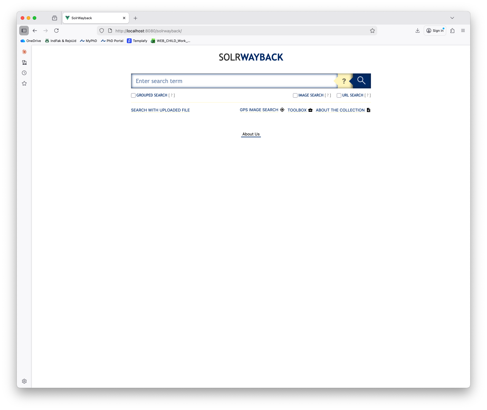
<!--  -->

You have now started the application successfully and are ready to make the WARC files from the EOTWA searchable in the system.

## Indexing
SolrWayback uses a search engine named Solr. To make your WARC files available for querying in SolrWayback you need to index the files. This process is OS dependent just as the start up above was. The first thing you need to do is to move the WARC files, that you downloaded earlier into their permanent place. For this lesson please move them into the directory `indexing/warcs1` inside the `solrwayback_package_5.4.2`. Once indexed, WARC files cannot be moved. Doing so breaks playback until you rebuild the index. Run the following commands in your Command Line Interface (CLI) — for example, Terminal or PowerShell.

  

    <h3>Linux/Mac</h3>
    
To index your WARC files from the directory <code>solrwayback_package_5.4.2/indexing/warcs1</code> please move into the directory <code>indexing</code> and run the following command in your terminal: <code>THREADS=2 ./warc-indexer.sh warcs1/*</code>.
 
  

  

    <h3>Windows</h3>
    
To index your WARC files from the directory <code>solrwayback_package_5.4.2/indexing/warcs1</code> please move into the directory <code>indexing</code> and run the following bat-file in your terminal: <code>batch_warcs1_folder.bat</code>

    
NOTE: On Windows it is very important that you follow the directions above explicitly and moves into the directory before you run the <code>.bat</code>-file.

  

<!--  -->

This indexes all documents in the `warcs1` folder. Your terminal will display output showing indexing progress — this is expected. When the indexing has finished your terminal will return to an interactive state, represented by a `$` and now you should be able to see the indexed documents in the SolrWayback web interface. To validate that the documents have been indexed, you can go to the application at the URL: http://localhost:8080/solrwayback/ and type `*:*` in the search box. This is a wildcard query that fetches all documents available in the application. This should return 6,031 results.

You have now indexed your WARC files into SolrWayback and can begin exploring their contents. To add more WARC files after finishing this lesson, place them in the `warcs1` or `warcs2` folder and re-run the indexing command.

## Querying, Navigating, and Visualising
You are now ready to start exploring your collection and discover interesting sources related to the End of Term collection from 2008. Many questions can be answered with sources from this collection. Throughout the next session some examples will be introduced. These examples draw on your subset of the collection, which contains relevant documents.

If for instance you are interested in analysing politicians views on immigration a starting point could be a query for the word `immigration`. In your small subset of the overall corpus, this query provides you with 80 results. If you press the top result, coming from the URL [http://bilirakis.house.gov...](http://localhost:8080/solrwayback/services/web/20090514060646/http://bilirakis.house.gov/index.php?option=com_content&task=view&id=193&Itemid=132) you are presented with a replayed version of the archived webpage.

This webpage was harvested on 14 May 2009. When you first view the Bilirakis website from 2009, it appears visually incomplete. To understand why, consider how the web and by extension the archived web is structured. The web is born fragmented and when a website is shown to you as a user, you could in theory be looking at a website where the text is located at one server and an image is located somewhere completely different.[^3] This fragmentation of source material also means that you cannot expect sources to shown in a complete state in the test corpus that you are working with here, as parts of the resources that are used to construct the webpage simply aren't available in the few archival sources that you have in hand through this lesson. The replay would almost certainly be more complete with a larger portion of the EOTWA collection.  

<!--  -->

To get an overview of how an individual site has been archived, SolrWayback provides a small but useful toolbar, when an archived site is shown. By pressing the toolbar in the top left corner and then pressing the button `View page resources`, you can get information on how the individual resources from the currently shown page have been archived. This explains why the replayed site shows mostly links and text. The resource overview below clearly shows that sixteen different resources that were part of the webpage when it was live is not included in your archived version. If you had been working with the complete version of the EOTWA collection the replay would be better as the missing resources are most likely located in some of the many other WARC files available at the End of Term Web Archive.

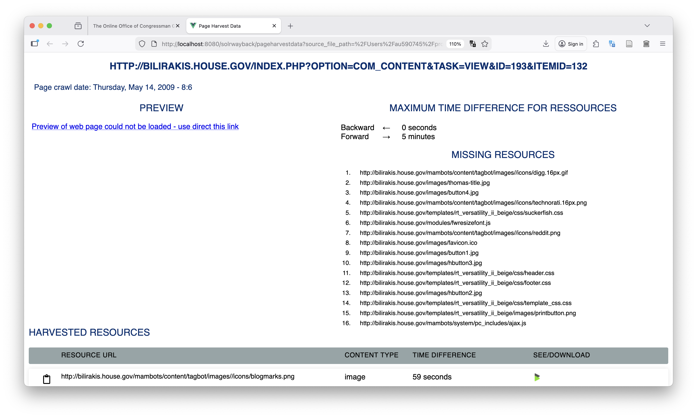
<!--  -->

The search field in SolrWayback supports a multitude of complex search functionalities. They can however be hard to navigate when using the software for the first time. The search box supports the standard query types found in any information retrieval system or library database. This includes traditional use of [Boolean operators](https://en.wikipedia.org/wiki/Boolean_algebra) such as AND, OR, and NOT. They must be entered in uppercase or else the search technology understands them as search terms instead of Boolean operators. To continue the example above, you might be interested in searching for the terms `immigration OR immigrant` to broaden the results from before. This provides you with 180 results compared to the `immigration` query, which only provided 80 results in your subset of the archive. To narrow results instead, use the Boolean operator AND. For example: `immigration AND mexican`, which only returns one result in your very limited corpus. These operators can also be used in combination, but then you would need to use parentheses to group search terms that are related to the individual Boolean operators. Staying with the example of immigration a combined query could look like this: `immigration OR (mexican AND immigrant)`.

Another standard searching functionality is wildcard searches. SolrWayback supports the following as a search term: `immigra*`. This returns all 192 results that contain any words starting with immigra- such as immigrant, immigration and such. Another wildcard character is `?`. The question mark replaces a single character in a search term. This can be useful in different contexts but especially when investigating sources that can be written in american or british english. For instance a query for `Analy?e ` captures results from analyse and analyze. In this example, this specific query returns 34 results that are all of the American variation as you are working with a very small subset of a vast US-centred archive. A third way of specifying queries in the search field is with the use of quotation marks. These can be used to search for specific sentences. A search for `"mexican immigrant"` returns results where the words occur directly after each other, whereas the earlier query of `mexican AND immigrant` returned results where the words where present in the same document, but not necessarily in the same sentence.

The searching strategies above are often available in all sorts of information retrieval systems and they provide a basis for constructing complex queries. SolrWayback also provides searching capabilities that are tailored towards the specific content from archived web material. Content and metadata for each document in your archive have been parsed and analysed during the indexing section above. In practice, this means much of the metadata is searchable in specific *fields*. A specific field can contain one type of content and only that type. For instance, all documents have the field `content_length` which contains a number representing how much content is available in the given document. A long text document would have a high number in this field, where as a short status update or an almost empty website would have a much lower number in this field. Searchable fields can be inputted as a query following the syntax: `fieldname:value in field`. To find documents with a content length of exactly 500, use: `content_length:500`. In your corpus this returns zero results. This is due to the fact that content lengths are often hard to specify directly. Luckily SolrWayback supports *range queries*. This is a type of query that can be used to specify an interval or limit on the number in a field. A range query follows the syntax `fieldname:[value TO value]`. To query for web pages with a content length between 1,000 and 5,000, use: `content_length:[1000 TO 5000]`, which returns 620 results. The range query syntax can also be used to define either an upper or lower limit. To do so an asterisk takes the place of the open end of the range query. To query for documents with a content length of less than 1,000, use `content_length:[* TO 1000]`; for documents with a content length above 5,000, use `content_length:[5000 TO *]`.

The section above uses the field `content_length` as the primary example of how to query with a field. SolrWayback contains multiple such fields. The quickest way to view them is to run a wildcard query (`*:*`) and then press the `View data fields` button shown below:

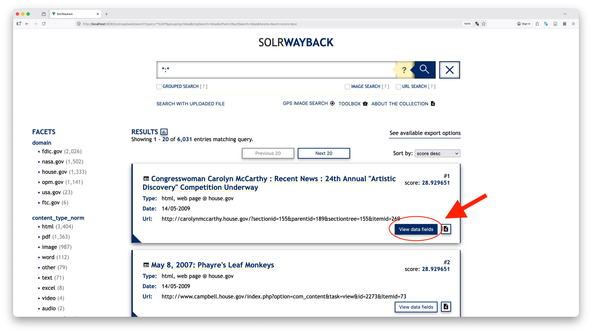
<!--  -->

When you press this button, a list of available fields appears. Here you see fields such as `content`, `content_type`, `crawl_date`, `elements_used`, `links` and many more. Most of these fields can be used in queries just as the `content_length` above. These fields can be used in multiple ways to construct very niche searches. For now it is enough to know where to find them for future reference.

### Buttons Below the Search Bar
You have now learned the basics of how the search field functions. As you will see throughout the rest of this lesson, SolrWayback contains many ways to navigate the archived web as a source. Right below the search bar two important toggle buttons are available. The two toggles presented here are `Grouped search` and `URL search`. 

Throughout this lesson you are working with a small subset of a bigger collection. Often, when working with the archived web you will be sifting through not only millions of documents, but also multiple copies of identical documents as archiving technologies archive all URLs even though an identical copy of the source already exist in the collection.[^4] The grouped search functionality in SolrWayback collapses results by URL into one when ticked. This can be very useful when exploring collections of more sources. 

The `URL Search` button contains another functionality which is important for you to know about. The use case for this button is the following, very common, situation. You have a collection of material and are interested in finding one special web page located at a specific URL. A case for this kind of use in your small collection could be to find the webpage of congress woman Virginia Foxx and you know that her web page have been archived from the specific URL: http://foxx.house.gov/index.cfm?sectionid=102&sectiontree=&pageNum=51. If you copy this URL directly into the search field and try to search for it, no results will be available. If however you tick the `URL Search` button and redo your search, you will find a result. Why is this so you may ask? URLs often contain special characters as '&' and '#'. When you ticked the `URL Search`-box, you instructed the software to handle these characters directly as part of the URL and therefore you get a valid result in this case.  

You have now been introduced to two toggle buttons that sit just below the search bar. The `Grouped search` button is particularly useful when working with large collections where identical documents have been archived multiple times, as it de-duplicates results by URL. The `URL Search` button solves a practical problem that arises frequently in web archive research: searching for a specific URL that contains special characters. Keeping both of these buttons in mind will help you retrieve the results you are actually looking for as you work your way through a collection of material from the archived web.

### Relationship Between Search and Facets

Until now, the lesson has been focused on how to search through the search bar. Another step in the search process is to apply facets to filter unwanted material away.

If you do a new `*:*`-query and then have a look at the resulting page. Here you get some useful information on the left of the screen. These are facets that give you an overview of content in your collection and they can be used to tailor your search. When a facet is clicked, it will be applied to your query and only documents with that value in the faceted field will be included in the result. 

<!--  -->

Facets can also be used to give an immediate overview of how the material in the collection is scattered on different domains, content types or crawl years etc. One important thing to mention in relation to facets is the relationship between entries in the search bar and the application of facets. Apply facets last as changing the search box input resets the query and removes all applied facets. You have now learned how to search through the search box and make use of the facets for filtering a search result.

### Navigation

Moving from search to reading and navigation of archived webpages can seem simple at first but there are some aspects of navigation that needs to be addressed. Any result from a search can be clicked and will then open a playback version of the archived webpage in a new browser window. When reading an archived webpage, keep the web's inherent media format in mind. Material from the archived web is characterised as reborn digital material and the archived material most often differ from the live version of the source.[^5] The archived web (and the live web) is fragmented by nature. This fragmentation plays an important part when you investigate an archived webpage. The page you are looking at is most likely constructed from multiple resources, eg. text, images, files. The resources making up a replayed page may have been harvested at different times and stitched together to appear as a coherent source.[^6] This is not a SolrWayback specific caveat but a general choice in wayback centred playback solutions. 

The archived website can be navigated in the same manner as a live website. Live and archived versions of web material are strongly dependent on hyperlinks for navigation.[^7] Navigation on the live web is however a bit more simple than navigation through archived links. In a web archive, clicking a link from an opened document can make the temporal situation shift. These shifts in temporality are rarely visualised for you as user of the software and because browsing the live web is second nature, you likely click through multiple links per day without thinking about it. Clicking a link in the playback view of SolrWayback works in the same way but you need to remember that the temporal context might change behind your back. To make this behaviour of navigation more visible a textual example follows: Imagine that you are interested in the website of congressman Gus Bilirakis used as an example above which has been archived on 14 May 2009. In a complete version of the archive multiple copies of this front-page had probably existed. When researching the web page you would probably click on multiple links such as the 'Newsroom' or 'Issues' links. The playback software would then redirect you to a version of the linked website that has a harvest time closest to the one of the current page. In your small subset of material from the EOTWA this is very hard to show as you do not have easy access to archived versions of linked pages. 

Let's use the Bilirakis website for a thought example of what would happen. Say you were interested in  the congressman's view on education. You would then probably be interested in following the link to his webpage on education. When you click this link you would be presented with a version of the webpage located at this [address](http://bilirakis.house.gov/index.php?option=com_content&task=view&id=187&Itemid=128). Another thing might also have happened, without you noticing it. You started from a page that had been archived on 14 May 2009 but you might, without knowing, have taken a time machine when you clicked the link. The link you clicked on might not have been collected on 14 May 2009. It might not have been collected in 2009 at all. If this is the case and the archive has a version of the requested page from 2008, 2010 or 2015 the playback engine in the software would show the version of the site that is closest in time without telling you that your temporal context has shifted. In SolrWayback and other Wayback based web archives such as the Internet Archive the harvest date can always be extracted from the archival URL. Returning to the Bilirakis front page in your SolrWayback collection which should be available at the following [URL](http://localhost:8080/solrwayback/services/web/20090514061634/http://bilirakis.house.gov/index.php?option=com_search&searchword=index.php?option=com_search&searchword=The%20Congenital%20Heart%20Futures%20Act&submit=Search&searchphrase=any&ordering=newest). The `/web/20090514061634`-part of the URL would also be present if you had accessed the source in the Internet Archive or any other web archive. The 14-digit number is a timestamp in the format YYYYMMDDHHMMSS. When you click a link in SolrWayback this date changes to the version closest to the URL you came from. In SolrWayback harvest date information can also be read in the toolbar accessible in the top left corner of the playback view. 

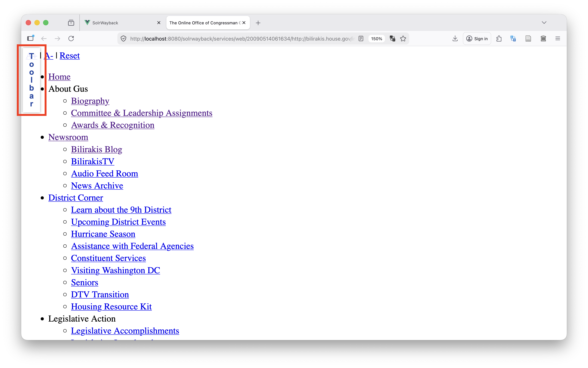
<!--  -->

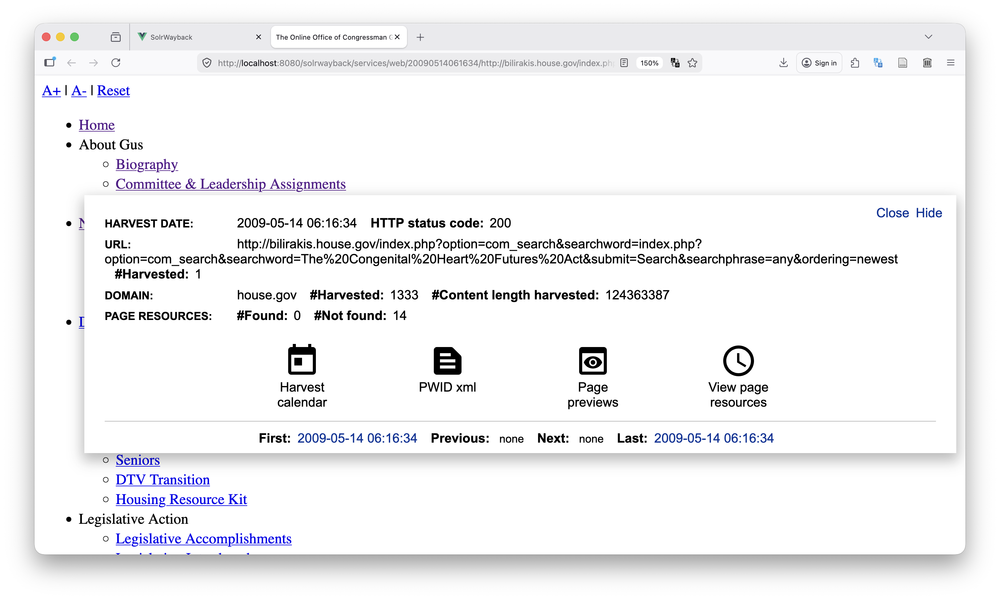
<!--  -->

The toolbar provides a human readable version of the harvest date and a quick overview of how much material us available on the given page. The time of collection can either be extracted directly from the URL or read in the toolbar. Remember that this timestamp changes when you click a link, because each source was collected individually. This resembles traditional library frameworks, just as the searching capabilities above did.[^8]

When working with vast amounts of sources, which is often the case when working with the archived web it is important to document your methodology and how you found the sources in the first place. This is true for all types of research, however researchers often forget to describe this important methodological part of doing research with born digital or reborn digital sources.[^9] SolrWayback contains a navigation tracking feature, which keeps a record of all the things you do as a user of the software. This navigation history can then be downloaded and used as part of a methodological argument, for transparency of source discovery, or for personal bookkeeping of what sources you have already investigated.[^10] The Navigation History button is available below the search box on the front page of the application.  

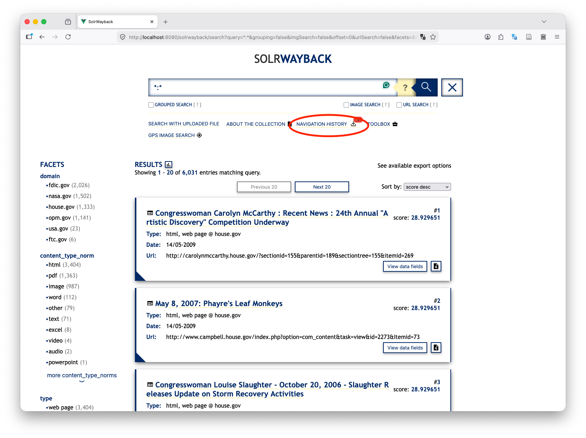
<!--  -->

### Tools for Visualisation

Collections of archived web material are often extremely big. Access to web archive collections should include tools that help researchers navigate large volumes of material.[^11] SolrWayback provides built-in tools for distant reading of archived web material. These tools can be found in the toolbox highlighted below.

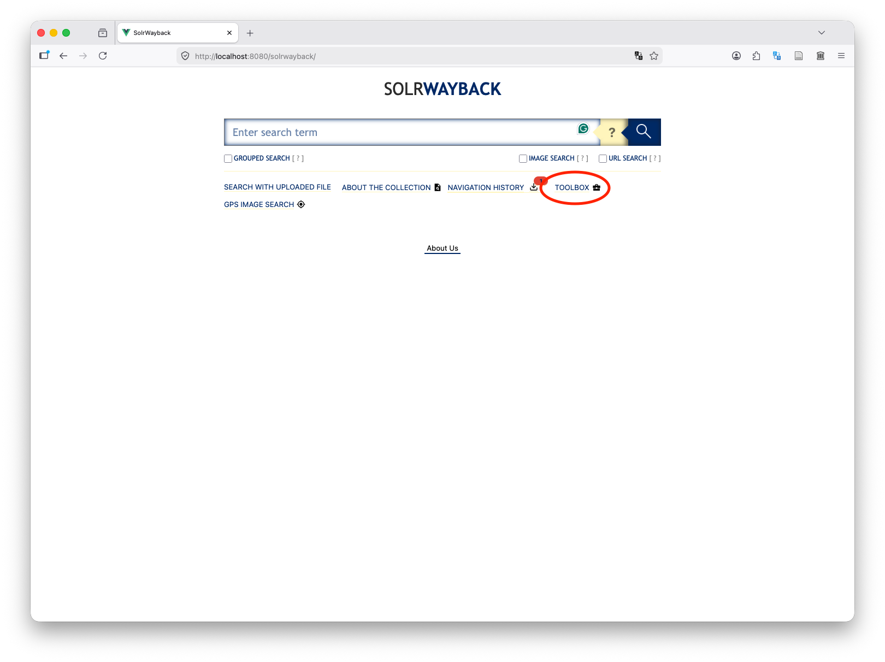
<!--  -->

The following section provides a brief overview of how these tools can be used to explore your collection. To make sure you can follow along, please make a query for everything: `*:*`. Now press the toolbar icon and you will be given the following screen:

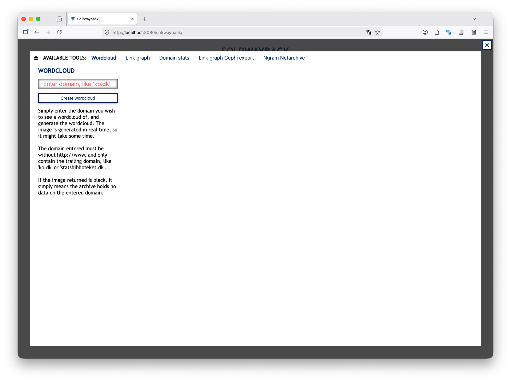
<!--  -->

The toolbox currently contains five different tools:
- Wordcloud
- Link Graph
- Domain stats
- Link graph Gephi export
- Ngram Netarchive

All input boxes contain an example text of kb.dk. In all steps below, this needs to be changed to a domain that is available in your small corpus. Most the time the lesson will use nasa.gov as the example here. The wordcloud tool provides the possibility of creating domain wide wordclouds. These can be used to gain an overview of what is the most used words across a specific domain. To see an example of how this looks enter `nasa.gov` in the field to the left and press `Create wordcloud`. This compiles a wordcloud of the most used terms across the nasa.gov domain in you collection.

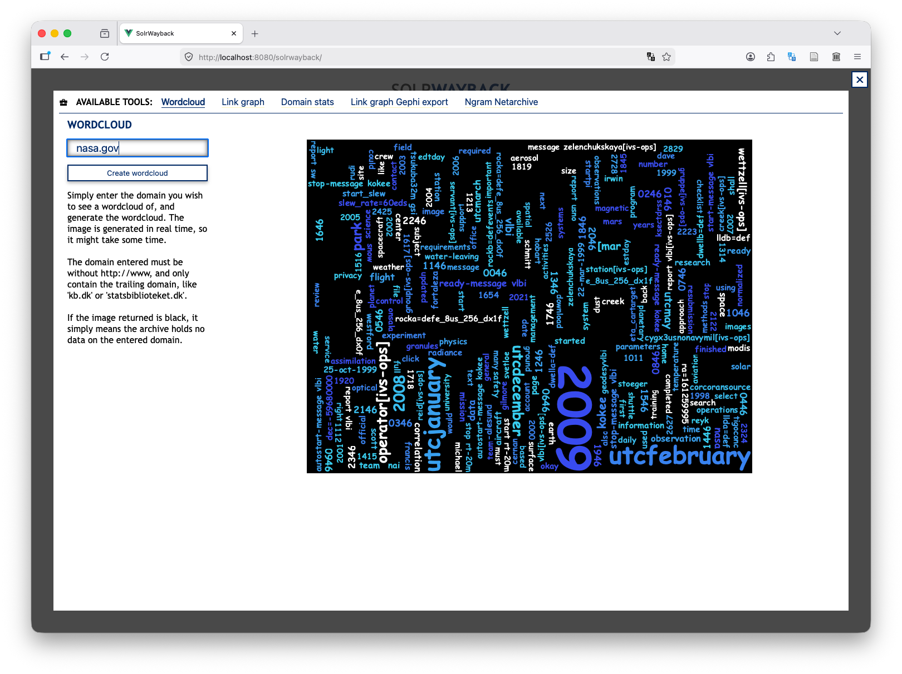
<!--  -->

The next tool, the link graph tool is central if you want to understand or investigate the linked nature of the web. Network analysis can be used for exploring how parts of the collection refer to other parts but are not as accurate as link analysis of the live web.[^12] Please press the `Link Graph`-tool in the top of the article and then input nasa.gov into the input field. Make sure that link direction is set to outgoing before you press generate. 

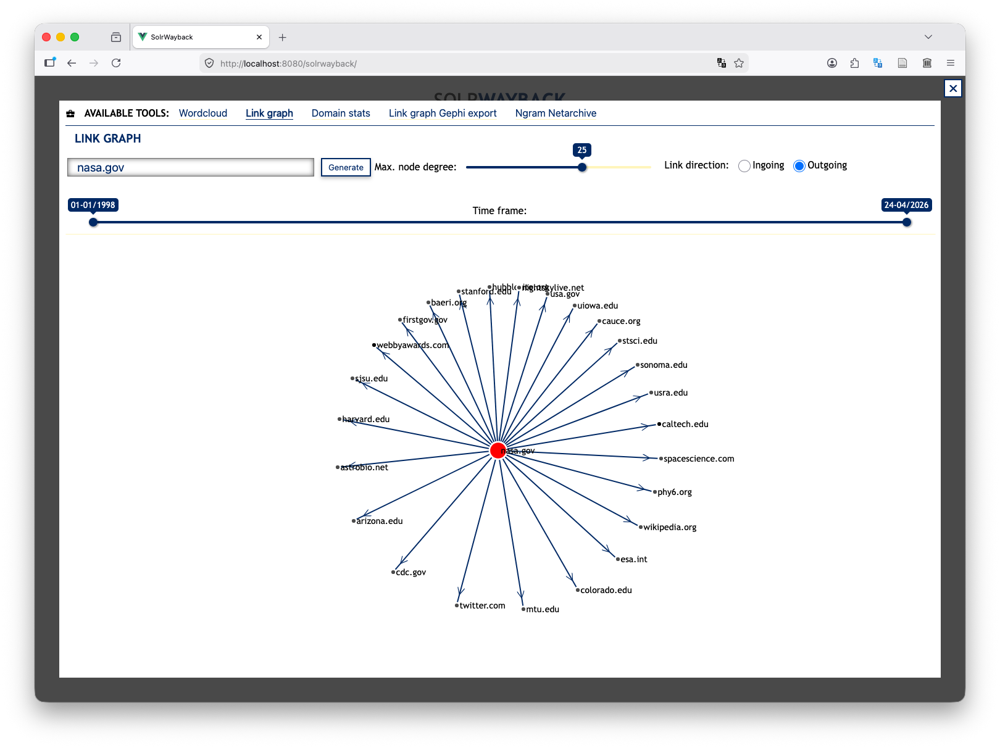
<!--  -->

What you see here are the domains, that are linked to from webpages on nasa.gov. It is also possible to produce a graph of ingoing links, which is often a more complex task, but because SolrWayback already has this information available through its index the graph can be constructed easily. To produce such a graph you toggle the radio button to ingoing and press generate again. However, for nasa.gov in your collection, this produces a meaningless graph with no edges. If you change the domain from nasa.gov to wikipedia.org you can get a feel of how a graph of ingoing links look. This link graph tool provides an accessible entrypoint to getting started with link analysis of archived web material. For more complex link analysis the tool Link graph Gephi export can be used to export needed data for complex analysis with the network analysis tool Gephi. For an introduction to network analysis in general see the Programming Historian lesson by Ladd et al. 2017.[^13]

Next in line is the domain stats tool. This tool can be used to visualise statistics about a single domain at different levels of granularity. To get an understanding of how this tool works enter nasa.gov in the input box. The X-axis defaults to the years 1998 to 2027. This can be changed in the two timeframe boxes. The scale of the X-axis can also be customised down to daily intervals. When you press the generate button a combined line chart appears. This combined chart visualises four distinct counts: Amount of pages, ingoing links, average page size in characters, and size in kilobytes. In this combined view it is possible to remove individual line charts by clicking their respective colors at the top of the visualisation. It is also possible to render all four charts individually by pressing the `Show Individual Charts`-button. The domain statistics can be used to investigate temporal changes in the archived material. Your subset from the total collection are all collected on the same day in 2009 and therefore there is not enough datapoints to create a telling visualisation. An example of how the graph could look with more data is shown here.

TODO: Insert domain stats for nasa.gov from webchild corpus. 

The last tool in the toolbox is the Ngram Netarchive tool. This tool can be used to discover and investigate how frequently a term appears in the collection over time. Multiple terms can be shown on the same graph at once by searching for them individually. For instance, staying in the space program example, you can add terms such as `nasa`, `space`, and `astronaut` to the visualisation and if you then had material from multiple years, the visualisation would represent how often the words were present in the collection. 

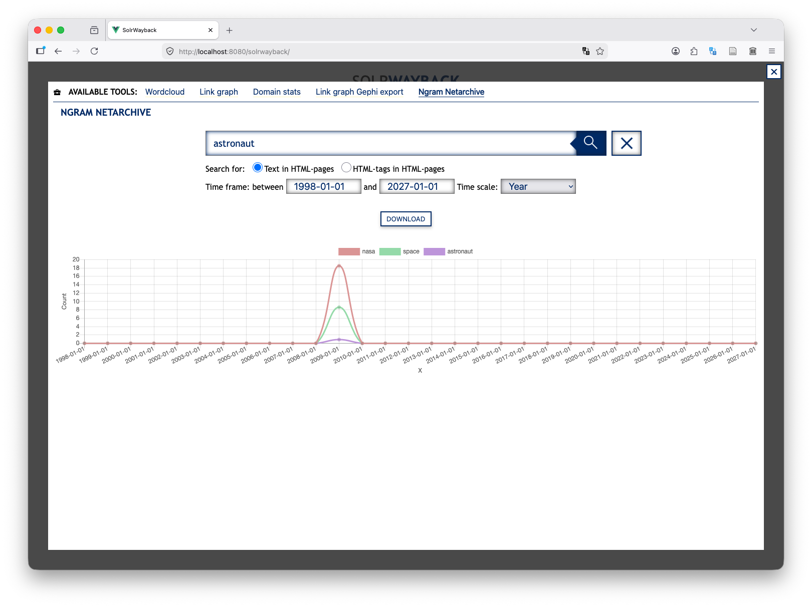
<!--  -->

This type of visualisation can be used to investigate trends in usage of different words. One important aspect of all of these tools to keep in mind is what they can be used to investigate. Collections from web archives are very strictly bound to the collecting practices of holding institutions such as the Internet Archive or the Royal Danish Library. This means that spikes in these visualisations needs to be treated with care as they can just as easily be a product of excessive collecting of material as markers of change.

The functionality of the toolbox can support you in initial distant readings of material in your collection. For further distant reading or quantitative approaches researchers often export data from SolrWayback.[^14] Data can be exported in many formats from the front page of the application.

## Conclusion: A New World of Source Material Emerges

This lesson has introduced a highly specific application for exploring archived web material. You have briefly been introduced to the storage format WARC, which stand as the foundation for web archiving systems. You've successfully installed SolrWayback on your local computer and have made a very small subset of material from the End of Term Web Archive available for discovery in the software. The material used as example in the lesson is freely accessible and a more covering subset can be acquired at the EOTWA itself.

Through SolrWayback it becomes possible to perform complex searches in material from web archives, that are otherwise often only available if you know the precise URL you are looking for. This lesson has taught you how to perform complex queries for material and navigate the archived web, which is quite often a temporal mess. 

SolrWayback includes a toolbox of tools for initial distant reading of archived web collections. This toolbox can be used as a starting point for computational analysis of reborn digital sources. These tools are build for larger collections that span archives of material collected on different dates as most of the tools visualise changes in material over time. With SolrWayback in hand you are prepared to explore larger collections of archived web material.

## Literature
Bell, Mark, Tom Storrar, and Jane Winters. ‘Chapter 2: Web Archives and the Problem of Access: Prototyping a Researcher Dashboard for the UK Government Web Archive’. In Archives, Access and Artificial Intelligence: Working with Born-Digital and Digitized Archival Collections, edited by Lise Jaillant. Bielefeld University Press, 2022. https://www.degruyterbrill.com/document/doi/10.1515/9783839455845-003/html.

Berlin, John, Mat Kelly, Michael L. Nelson, and Michele C. Weigle. ‘To Re-Experience the Web: A Framework for the Transformation and Replay of Archived Web Pages’. ACM Trans. Web 17, no. 4 (2023): 28:1-28:49. https://doi.org/10.1145/3589206.

Brügger, Niels. ‘Historical Network Analysis of the Web’. Social Science Computer Review (Los Angeles, CA) 31, no. 3 (2013): 306–21. https://doi.org/10.1177/0894439312454267.

Brügger, Niels. The Archived Web: Doing History in the Digital Age. The MIT Press, 2018.

Gomes, Daniel, André L. Santos, and Mário J. Silva. ‘Managing Duplicates in a Web Archive’. Proceedings of the 2006 ACM Symposium on Applied Computing, 23 April 2006, 818–25. https://doi.org/10.1145/1141277.1141465.

Hegarty, Kieran. ‘The Invention of the Archived Web: Tracing the Influence of Library Frameworks on Web Archiving Infrastructure’. Internet Histories 6, no. 4 (2022): 432–51. https://doi.org/10.1080/24701475.2022.2103988.

Hockx-Yu, Helen. ‘Access and Scholarly Use of Web Archives’. Alexandria: The Journal of National and International Library and Information Issues, ahead of print, 2014. https://doi.org/10.7227/ALX.0023.

Jensen, Helle Strandgaard. ‘Digital Archival Literacy for (All) Historians’. In Media History, vol. 27. no. 2. 2021. https://doi.org/10.1080/13688804.2020.1779047.

Johnston, Victor Harbo. ‘Introducing Reproducible Navigation of a Web Archive: SolrWayback Navigation Tracker’. Computational Humanities Research, 13 April 2026, 1–8. https://doi.org/10.1017/chr.2026.10030.

Kurzmeier, Michael. ‘Contextualizing and Unlocking Political Web Defacements for Research’. Journal of Digital History, no. preprint (2025).

Ladd, John R., Jessica Otis, Christopher N. Warren, and Scott Weingart. ‘Exploring and Analyzing Network Data with Python’. Programming Historian, 23 August 2017. https://programminghistorian.org/en/lessons/exploring-and-analyzing-network-data-with-python.

Maemura, Emily. ‘All WARC and No Playback: The Materialities of Data-Centered Web Archives Research’. Big Data & Society 10, no. 1 (2023): 20539517231163172. https://doi.org/10.1177/20539517231163172.

Milligan, Ian, and James Baker. ‘Introduction to the Bash Command Line’. Programming Historian, 20 September 2014. https://programminghistorian.org/en/lessons/intro-to-bash.

Putnam, Lara. ‘The Transnational and the Text-Searchable: Digitized Sources and the Shadows They Cast’. The American Historical Review (Oxford) 121, no. 2 (2016): 377–402. https://doi.org/10.1093/ahr/121.2.377.

Ruest, Nick, Samantha Fritz, and Ian Milligan. ‘Creating Order from the Mess: Web Archive Derivative Datasets and Notebooks’. Archives and Records 43, no. 3 (2022): 316–31. https://doi.org/10.1080/23257962.2022.2100336.

##### Endnotes
[^1]: Emily Maemura, ‘All WARC and No Playback: The Materialities of Data-Centered Web Archives Research’, Big Data & Society 10, no. 1 (2023): 20539517231163172, https://doi.org/10.1177/20539517231163172; Nick Ruest et al., ‘Creating Order from the Mess: Web Archive Derivative Datasets and Notebooks’, Archives and Records 43, no. 3 (2022): 316–31, https://doi.org/10.1080/23257962.2022.2100336.

[^2]: Michael Kurzmeier, ‘Contextualizing and Unlocking Political Web Defacements for Research’, Journal of Digital History, no. preprint (2025).

[^3]: Niels Brügger, The Archived Web: Doing History in the Digital Age (The MIT Press, 2018).

[^4]: Daniel Gomes et al., ‘Managing Duplicates in a Web Archive’, Proceedings of the 2006 ACM Symposium on Applied Computing, 23 April 2006, 818–25, https://doi.org/10.1145/1141277.1141465.

[^5]: Brügger, The Archived Web: Doing History in the Digital Age, p. 22-23; Emily Maemura, ‘All WARC and No Playback: The Materialities of Data-Centered Web Archives Research’, p. 8.

[^6]: John Berlin et al., ‘To Re-Experience the Web: A Framework for the Transformation and Replay of Archived Web Pages’, ACM Trans. Web 17, no. 4 (2023): 28:1-28:49, https://doi.org/10.1145/3589206.

[^7]: Niels Brügger, The Archived Web: Doing History in the Digital Age, p. 28-30.

[^8]: Kieran Hegarty, ‘The Invention of the Archived Web: Tracing the Influence of Library Frameworks on Web Archiving Infrastructure’, p. 447, Internet Histories 6, no. 4 (2022): 432–51, https://doi.org/10.1080/24701475.2022.2103988; Helen Hockx-Yu, ‘Access and Scholarly Use of Web Archives’, Alexandria: The Journal of National and International Library and Information Issues, ahead of print, 2014, https://doi.org/10.7227/ALX.0023.

[^9]: Lara Putnam, ‘The Transnational and the Text-Searchable: Digitized Sources and the Shadows They Cast’, The American Historical Review (Oxford) 121, no. 2 (2016): 377–402, https://doi.org/10.1093/ahr/121.2.377; Helle Strandgaard Jensen, ‘Digital Archival Literacy for (All) Historians’, in Media History, vol. 27, no. 2, 2021, https://doi.org/10.1080/13688804.2020.1779047.

[^10]: Victor Harbo Johnston, ‘Introducing Reproducible Navigation of a Web Archive: SolrWayback Navigation Tracker’, Computational Humanities Research, 13 April 2026, 1–8, https://doi.org/10.1017/chr.2026.10030.

[^11]: Ruest et al., ‘Creating Order from the Mess’; Hockx-Yu, ‘Access and Scholarly Use of Web Archives’; Mark Bell et al., ‘Chapter 2: Web Archives and the Problem of Access: Prototyping a Researcher Dashboard for the UK Government Web Archive’, in Archives, Access and Artificial Intelligence: Working with Born-Digital and Digitized Archival Collections, ed. Lise Jaillant (Bielefeld University Press, 2022), https://www.degruyterbrill.com/document/doi/10.1515/9783839455845-003/html.

[^12]: Niels Brügger, ‘Historical Network Analysis of the Web’, Social Science Computer Review (Los Angeles, CA) 31, no. 3 (2013): 306–21, https://doi.org/10.1177/0894439312454267.

[^13]: John R. Ladd et al., ‘Exploring and Analyzing Network Data with Python’, Programming Historian, 23 August 2017, https://programminghistorian.org/en/lessons/exploring-and-analyzing-network-data-with-python.

[^14]: Kurzmeier, ‘Contextualizing and Unlocking Political Web Defacements for Research’.

[^15]: Ian Milligan and James Baker, ‘Introduction to the Bash Command Line’, Programming Historian, 20 September 2014, https://programminghistorian.org/en/lessons/intro-to-bash.

